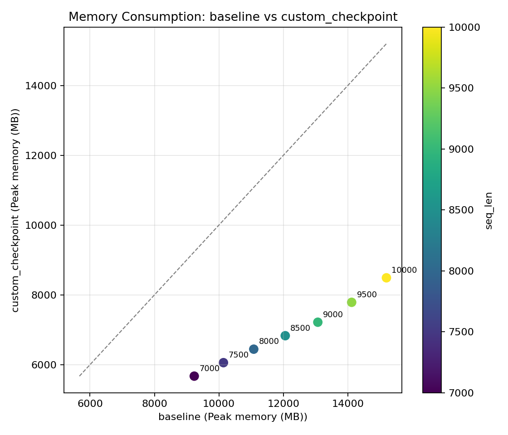
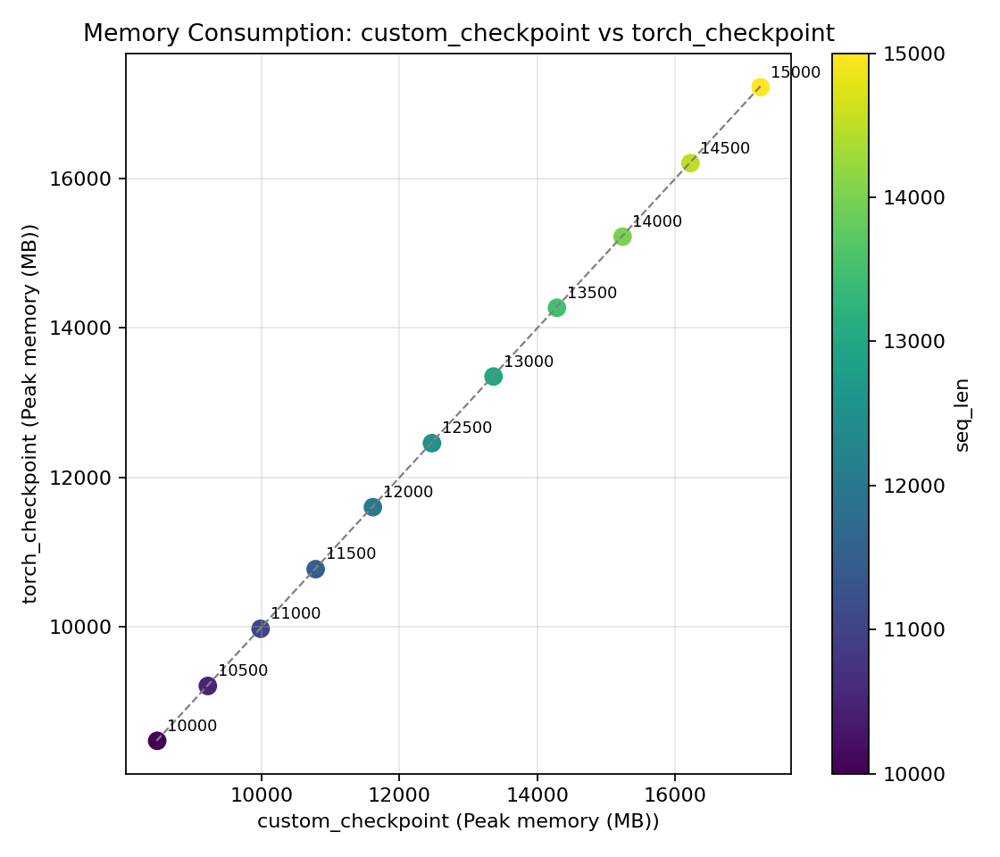
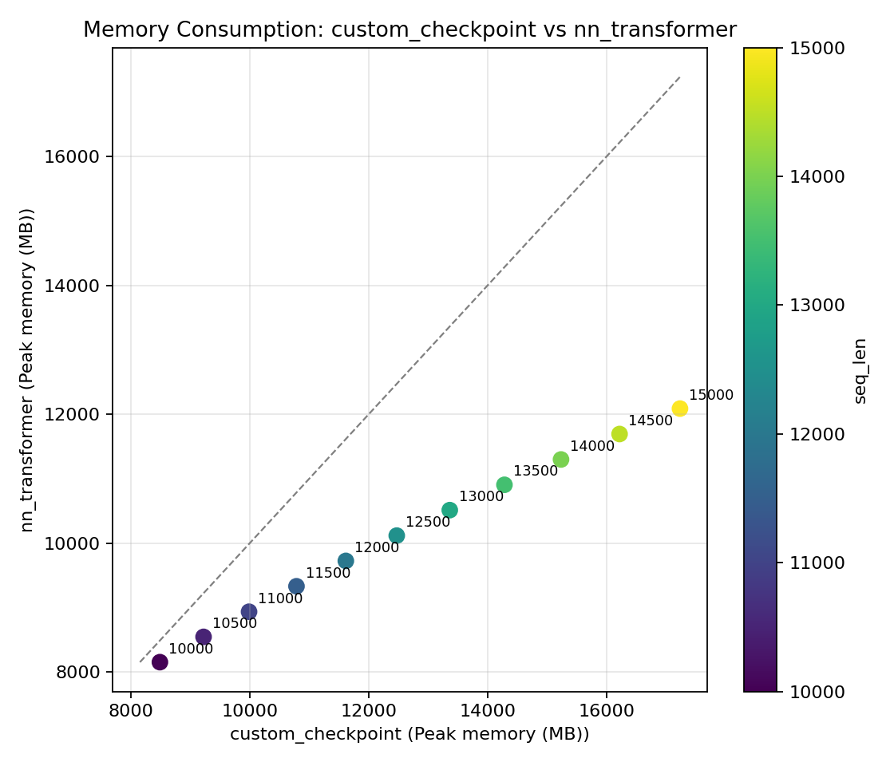
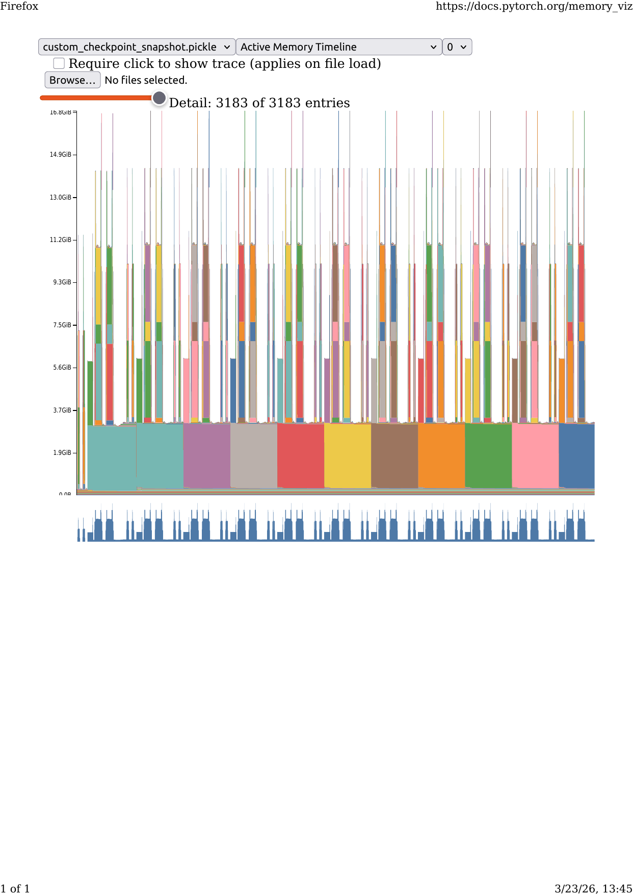

# Activation Checkpointing Benchmark

This project benchmarks activation checkpointing strategies for Transformer language models in PyTorch.

It compares:
- `baseline`: custom Transformer without checkpointing
- `custom_checkpoint`: custom Transformer with manual checkpointing (`src/ckpt.py`)
- `torch_checkpoint`: custom Transformer with `torch.utils.checkpoint`
- `nn_transformer`: `nn.TransformerEncoder`-based reference model

The benchmark reports:
- Average training step time
- Peak CUDA memory (when running on GPU)
- Self CUDA execution time per step from `torch.profiler`

## Repository Layout

```text
.
|- run_config.py          # Single-run profiler for one sequence length
|- evaluate.py            # Sequence-length sweep + CSV + pairwise plots
|- src/
|  |- transformer.py      # Custom TransformerLM + nn.Transformer baseline
|  |- ckpt.py             # Manual activation checkpoint implementation
|  |- utilsf.py           # Profiling/memory helper utilities
|- benchmark_runs/        # Auto-generated run outputs
```

## Requirements

- Python 3.10+
- PyTorch (CUDA-enabled build if you want GPU memory metrics)
- Matplotlib

Install dependencies (minimal):

```bash
python -m pip install --upgrade pip
python -m pip install torch matplotlib
```

## Quick Start

Run one profiling pass for a fixed sequence length:

```bash
python run_config.py --device cuda --seq_len 4096 --scenario all
```

Run a sequence-length sweep and generate CSV + pairwise plots:

```bash
python evaluate.py \
  --device cuda \
  --seq_start 7000 \
  --seq_end 10000 \
  --seq_step 500 \
  --scenario all
```

## Unit Testing

Run activation-checkpointing unit tests:

```bash
python -m unittest tests.test_checkpointing -v
```

Test 1 checks that checkpointed forward/backward matches eager execution (outputs, input gradients, parameter gradients).
Test 2 checks RNG-preserving behavior with dropout using preserve_rng_state=True, ensuring checkpointed results match eager results under same seed.

## Main CLI Options

Common model/training controls (both scripts):
- `--device` (`cuda` or `cpu`)
- `--batch_size`
- `--vocab_size`
- `--d_model`
- `--n_heads`
- `--n_layers`
- `--mlp_ratio`
- `--dropout`
- `--warmup_steps`
- `--measured_steps`

Scenario selection:
- `--scenario all`
- or one/more explicit choices: `baseline custom_checkpoint torch_checkpoint nn_transformer`

`run_config.py`-specific:
- `--seq_len`
- `--cuda_snapshot_dir`
- `--cuda_snapshot_max_entries`
- `--profiler_trace_dir`
- `--run_output_root`

`evaluate.py`-specific:
- `--seq_start`
- `--seq_end`
- `--seq_step`
- `--out_csv`
- `--pairwise_out_dir`
- `--run_output_root`


## Evaluated Model Configuration

Configuration used for the analysis plots in this README:

- Device: A5000
- Batch size: 1
- Vocab size: 50257
- d_model: 128
- n_heads: 4
- n_layers: 2
- MLP ratio: 4.0 (feed-forward hidden dimension = 512)
- Dropout: 0.1
- Warmup steps: 1
- Measured steps: 30
- Scenarios compared in figures:
  - `baseline` vs `custom_checkpoint`
  - `custom_checkpoint` vs `nn_transformer`

Implementation details:
- `baseline` and `custom_checkpoint` use `TransformerLM` from `src/transformer.py`.
- `custom_checkpoint` uses manual checkpointing from `src/ckpt.py`.
- `nn_transformer` uses `NNTransformerLM` (`nn.TransformerEncoder`, GELU, `norm_first=True`, `batch_first=True`).

## Output Structure

Each run writes into a unique timestamped folder under `benchmark_runs/`.

`evaluate.py` creates directories like:

```text
benchmark_runs/
  evaluate_YYYYMMDD_HHMMSS_microseconds/
    scenario_runs/
      run_YYYYMMDD_HHMMSS_microseconds/
        run_metadata.json
    plots/
      seq_len_sweep.csv
      pairwise/
        pair_cuda_exec_<scenarioA>_vs_<scenarioB>.png
        pair_memory_<scenarioA>_vs_<scenarioB>.png
```

`run_config.py` creates directories like:

```text
benchmark_runs/
  run_YYYYMMDD_HHMMSS_microseconds/
    run_metadata.json
    cuda_memory_snapshots/   # if enabled
    <trace_dir>/             # if --profiler_trace_dir is set
```

## Notes

- Peak memory and CUDA execution metrics are available only on CUDA.
- On CPU, memory/CUDA-specific outputs are reported as unavailable.
- CUDA memory snapshots (`.pickle`) can be visualized at:
  https://pytorch.org/memory_viz

## Analysis

Graph indicates that checkpointing consumes less peak memory than the non-checkpointed baseline for the tested sequence lengths.



_Figure: Peak memory comparison across sequence lengths for `baseline` (x-axis) vs `custom_checkpoint` (y-axis)._ 

In the `custom_checkpoint` vs `torch_checkpoint` memory comparison, memory consumption is similar across all tested sequence lengths — the manual checkpointing implementation matches `torch.utils.checkpoint` in peak memory usage.

This is further confirmed by a second independent run at a longer sequence-length range:



_Figure: Second run — peak memory comparison for `custom_checkpoint` (x-axis) vs `torch_checkpoint` (y-axis). Points cluster tightly on the y=x line, confirming equivalent memory consumption._

From diagram we can colclude that the scratch-implemented Transformer with manual checkpointing consumes more peak memory than the `nn.TransformerEncoder`-based model in that token range.
For this workload and configuration, activation checkpointing in the custom-from-scratch stack does not outperform the built-in `nn.Transformer` path on peak memory at longer contexts.



_Figure: Peak memory comparison across sequence lengths for `custom_checkpoint` (x-axis) vs `nn_transformer` (y-axis)._ 

## CUDA Memory Timeline — `custom_checkpoint`



The most important thing to observe is the **sawtooth pattern**: memory rises sharply during the forward pass, drops when activations are freed at the end of each checkpointed block, then spikes again during the backward recomputation before falling back as gradients are consumed. This pattern confirms that manual checkpointing is working correctly — intermediate activations are not retained between the forward and backward pass, keeping the steady-state memory footprint low.

## torch.profiler Results — `custom_checkpoint`

```
-------------------------------------------------------  ------------  ------------  ------------  ------------  ------------  ------------  ------------  ------------  ------------  ------------
                                                   Name    Self CPU %      Self CPU   CPU total %     CPU total  CPU time avg     Self CUDA   Self CUDA %    CUDA total  CUDA time avg    # of Calls
-------------------------------------------------------  ------------  ------------  ------------  ------------  ------------  ------------  ------------  ------------  ------------  ------------
                          ampere_sgemm_128x128_nn         0.00%       0.000us         0.00%       0.000us       0.000us     863.505ms        13.01%     863.505ms      14.392ms            60
void at::native::elementwise_kernel<128, 2, ...>         0.00%       0.000us         0.00%       0.000us       0.000us     700.799ms        10.56%     700.799ms       5.840ms           120
                 Memcpy DtoD (Device -> Device)         0.00%       0.000us         0.00%       0.000us       0.000us     602.230ms         9.07%     602.230ms      10.037ms            60
                          ampere_sgemm_128x128_nt         0.00%       0.000us         0.00%       0.000us       0.000us     564.837ms         8.51%     564.837ms      14.121ms            40
void at::native::cunn_SoftMaxForward<...>               0.00%       0.000us         0.00%       0.000us       0.000us     548.505ms         8.26%     548.505ms      13.713ms            40
void at::native::fused_dropout_kernel<...>              0.00%       0.000us         0.00%       0.000us       0.000us     480.658ms         7.24%     480.658ms       3.697ms           130
                          ampere_sgemm_128x128_tn         0.00%       0.000us         0.00%       0.000us       0.000us     455.845ms         6.87%     455.845ms       7.597ms            60
void at::native::cunn_SoftMaxBackward<...>              0.00%       0.000us         0.00%       0.000us       0.000us     382.838ms         5.77%     382.838ms      19.142ms            20
void at::native::vectorized_elementwise_kernel<4,...>   0.00%       0.000us         0.00%       0.000us       0.000us     302.462ms         4.56%     302.462ms       5.041ms            60
void at::native::vectorized_elementwise_kernel<2,...>   0.00%       0.000us         0.00%       0.000us       0.000us     301.253ms         4.54%     301.253ms       5.021ms            60
-------------------------------------------------------  ------------  ------------  ------------  ------------  ------------  ------------  ------------  ------------  ------------  ------------
Self CPU time total: 6.446s
Self CUDA time total: 6.637s
```

**Sorted by `self_cuda_time_total`** on CUDA devices (falls back to `self_device_time_total` if that attribute is absent, then `self_cpu_time_total` on CPU). This surfaces the kernels that spend the most time actually executing on the GPU, ignoring time spent waiting on sub-calls.
**Top 10 rows only** — `row_limit=10`, so only the heaviest kernels by self CUDA time are shown.

Key takeaways from the profiling run:

**Matrix multiplications dominate GPU time.** The top three CUDA kernels are all `ampere_sgemm` variants (`nn`, `nt`, `tn` — corresponding to forward QKV projection, key/value attention products, and output projection), collectively accounting for ~28% of total CUDA time. This is expected for a Transformer — attention and feed-forward linear layers are the computational core.\

**DtoD memory copies consume 9% of CUDA time** (602 ms over 60 calls). These are caused by activation checkpointing reloading saved inputs back to the recomputation kernel during the backward pass — a direct and measurable cost of trading compute for memory.

**SoftMax runs at 20 calls for backward vs 40 for forward**, because only one backward recompute pass is needed per block, confirming the checkpointing schedule is correct.

**Dropout (`fused_dropout_kernel`) is the most-called kernel** (130 calls), appearing in both attention and feed-forward sub-layers across forward and recomputation passes.

**Total CUDA time (6.637 s) slightly exceeds CPU time (6.446 s)**, confirming GPU-bound execution with good CPU–GPU overlap.


## Further Improvements: Selective Activation Checkpointing

Potential next improvements:

-Auto-tune checkpoint policy per GPU budget (optimize for a memory cap with minimum latency).

-Combine with mixed precision and FlashAttention-style kernels for better speed-memory trade-offs.